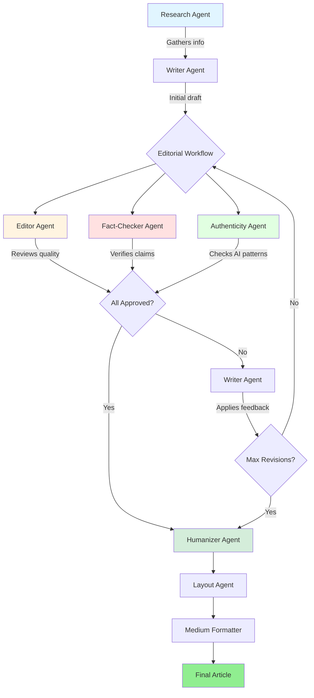

# Research Agent

Deep research agent using Bedrock AgentCore with multi-agent editorial workflow for producing magazine-quality articles.

## Quick Start

```bash
# 1. Setup
python3 -m venv venv
source venv/bin/activate
pip install -r requirements.txt

# 2. Configure AWS
export AWS_PROFILE=your-profile-name
export AWS_REGION=us-east-1

# 3. Run
python agent.py "your topic here"
```

## Architecture



## Agent Roles

### 1. Research Agent 🔬
**Purpose**: Gather information from multiple sources
- Searches internet (Tavily API)
- Queries Google News (GoogleNews package)
- Accesses Bedrock Knowledge Base
- Crawls web pages
- Synthesizes findings with confidence scoring

**Model**: Claude Sonnet 4.5 (`us.anthropic.claude-sonnet-4-5-20250929-v1:0`)

### 2. Writer Agent ✍️
**Purpose**: Create and revise journalist-quality articles
- Writes initial draft from research findings
- Applies editorial feedback
- Implements fact-checker corrections
- Maintains authentic journalist voice
- Produces 2000-3000 word articles

**Model**: Claude Haiku 4.5 (`global.anthropic.claude-haiku-4-5-20251001-v1:0`)

### 3. Editor Agent 📝
**Purpose**: Review article quality and provide feedback
- Evaluates structure, voice, evidence, analysis, clarity
- Assigns grades (A+/A/A-/B+/B/B-/C/D/F)
- Identifies critical issues
- Provides specific line edits
- Approves for publication (requires A or A+)

**Model**: Claude Haiku 4.5 (`global.anthropic.claude-haiku-4-5-20251001-v1:0`)

### 4. Fact-Checker Agent 🔍
**Purpose**: Verify claims, sources, and statistics
- Checks all factual assertions
- Verifies URLs are accessible
- Validates statistics against sources
- Flags unsupported claims
- Assigns verification score (0-100, requires ≥80)

**Model**: Claude Sonnet 4 (`us.anthropic.claude-sonnet-4-20250514-v1:0`)

### 5. Authenticity Agent 🤖
**Purpose**: Detect and remove AI writing patterns
- Identifies AI-generated patterns
- Flags repetitive constructions
- Checks for authentic human voice
- Assigns authenticity score (0-100, requires ≥85)

**Model**: Claude Haiku 4.5 (`global.anthropic.claude-haiku-4-5-20251001-v1:0`)

### 6. Humanizer Agent 👤
**Purpose**: Final polish for human-like writing
- Removes remaining AI patterns
- Adds natural variations
- Ensures authentic voice

**Model**: Claude Haiku 4.5 (`global.anthropic.claude-haiku-4-5-20251001-v1:0`)

### 7. Layout Agent 🎨
**Purpose**: Enhance article with visual elements
- Searches for relevant images
- Adds pull quotes
- Formats for web display

**Model**: Claude Haiku 4.5 (`global.anthropic.claude-haiku-4-5-20251001-v1:0`)

### 8. Medium Formatter Agent 📱
**Purpose**: Format for Medium.com publication
- Converts to Medium-friendly markdown
- Optimizes for readability
- Adds proper citations

**Model**: Claude Haiku 4.5 (`global.anthropic.claude-haiku-4-5-20251001-v1:0`)

## Workflow Process

### Phase 1: Research & Writing
1. Research Agent gathers information on topic
2. Generates research questions
3. Queries multiple sources (internet, Google News, KB)
4. Iterates until confidence ≥ 0.8 (max 6 iterations)
5. Writer Agent creates initial draft

### Phase 2: Editorial Review (Max 10 Revisions)
Each revision cycle:
1. **Editor reviews** → quality, structure, voice
2. **Fact-checker verifies** → claims, sources, statistics
3. **Authenticity checks** → AI patterns, human voice
4. **Research feedback loop** (if needed):
   - Triggered when fact-check score < 80 OR source issues detected
   - Research Agent extracts specific claims needing sources
   - Does targeted search for missing/weak sources
   - New findings added to research cache
   - Writer receives updated research context
5. **Feedback combined** → prioritized issues list
6. **Writer revises** → applies all feedback with new sources

Stops when:
- All three agents approve (Editor A/A+, Fact-check ≥80, Authenticity ≥85), OR
- Max revisions reached (with warning if issues remain)

### Phase 3: Publication
1. **Humanizer Agent** → final polish for natural voice
2. **Layout Agent** → adds images and pull quotes
3. **Medium Formatter** → formats for Medium.com

Final article saved with metadata:
- Editor grade
- Fact-check score
- Authenticity score
- Revision history
- Research confidence

## Features

- **Internet search**: Real-time web search using Tavily API
- **Google News**: Latest news articles using GoogleNews package
- **Multi-source retrieval**: Knowledge Base, Google News, web crawling
- **Iterative deepening**: Researches until confidence threshold met
- **Source attribution**: Tracks which source provided each finding
- **Gap identification**: Identifies missing information for follow-up
- **Article writing**: Generates professional 2000-3000 word articles
- **Editorial review**: Multi-agent quality control (Editor, Fact-checker, Authenticity)
- **Fact-checking**: Verifies every claim and source with Sonnet 4
- **Authenticity checking**: Detects and removes AI writing patterns
- **Revision cycles**: Iterative improvement like real magazines
- **Humanization**: Final polish for authentic human voice
- **Layout enhancement**: Images, pull quotes, visual formatting
- **Medium formatting**: Ready-to-publish Medium.com articles
- **Robust error handling**: Multi-layer retry with exponential backoff

## Setup

### Prerequisites
- Python 3.12+
- AWS credentials with Bedrock access (us-east-1 region)
- Tavily API key (optional, for internet search)

### Installation

```bash
# Clone the repository
git clone <repository-url>
cd journalist-writer

# Create virtual environment
python3 -m venv venv
source venv/bin/activate  # On Windows: venv\Scripts\activate

# Install dependencies
pip install -r requirements.txt

# Set environment variables
export AWS_REGION=us-east-1
export AWS_PROFILE=your-profile-name
export TAVILY_API_KEY=your-tavily-key  # Optional
export KNOWLEDGE_BASE_ID=your-kb-id    # Optional
```

### Get Tavily API Key (Optional)

1. Visit https://tavily.com
2. Sign up for free account
3. Get API key from dashboard
4. Set environment variable: `export TAVILY_API_KEY=your-key`
5. Tavily provides 1000 free searches/month

## Usage

### Run Complete Workflow

```bash
# Activate virtual environment
source venv/bin/activate  # On Windows: venv\Scripts\activate

# With default topic (AI bubble)
AWS_PROFILE=your-profile python agent.py

# With custom topic
AWS_PROFILE=your-profile python agent.py "your topic here"
```

### Resume Editorial Workflow

Resume from a specific article version with optional user feedback:

```bash
# Activate virtual environment first
source venv/bin/activate

# Resume without additional feedback
python resume_workflow.py output/generated/TOPIC_TIMESTAMP/article_v6.md

# Resume with user feedback
python resume_workflow.py output/generated/TOPIC_TIMESTAMP/article_v6.md "Add more concrete examples about X. The section on Y needs more data to support the claim."
```

**How it works:**
1. Loads the specified article version (e.g., `article_v6.md`)
2. Loads previous feedback from editor, fact-checker, and authenticity agents
3. Combines previous feedback with your new user feedback (if provided)
4. Sends everything to the writer agent for revision
5. Continues the editorial workflow from that point
6. Research findings are loaded from cache automatically

**Use cases:**
- Add your own editorial feedback after reviewing an article
- Request specific changes or additions
- Continue workflow after manual edits
- Iterate on specific sections that need improvement

**Example workflow:**
```bash
# 1. Run initial generation
AWS_PROFILE=your-profile python agent.py "AI trends 2026"

# 2. Review the generated article in output/generated/AI_trends_2026_TIMESTAMP/

# 3. Provide feedback and resume
python resume_workflow.py output/generated/AI_trends_2026_TIMESTAMP/article_v3.md \
  "The section on enterprise adoption needs more specific company examples. \
   Add data on ROI metrics. The conclusion feels rushed - expand it."

# 4. Review the revised article and repeat if needed
```

### Output Structure

```
output/generated/TOPIC_TIMESTAMP/
├── article_v1_draft.md          # Initial draft
├── editor_feedback_v1.json      # Editor's first review
├── fact_check_v1.json           # Fact-checker's first review
├── authenticity_check_v1.json   # Authenticity first check
├── article_v2.md                # First revision
├── editor_feedback_v2.json      # Second review
├── fact_check_v2.json           # Second fact-check
├── authenticity_check_v2.json   # Second authenticity check
├── article_v3.md                # Second revision (if needed)
├── article_final.md             # Humanized final version
├── article_enhanced.html        # With images and layout
├── article_medium.md            # Medium.com format
└── article_medium.html          # Medium.com HTML
```

## Configuration

Edit `config.py`:
- `AWS_REGION = 'us-east-1'`
- `RSS_CACHE_FILE = 'output/articles.json'`
- `MAX_RESEARCH_ITERATIONS = 6`
- `CONFIDENCE_THRESHOLD = 0.8`

Models:
- Research: Claude Sonnet 4.5 (`us.anthropic.claude-sonnet-4-5-20250929-v1:0`)
- Writer: Claude Haiku 4.5 (`global.anthropic.claude-haiku-4-5-20251001-v1:0`)
- Editor: Claude Haiku 4.5 (`global.anthropic.claude-haiku-4-5-20251001-v1:0`)
- Fact-Checker: Claude Sonnet 4 (`us.anthropic.claude-sonnet-4-20250514-v1:0`)
- Authenticity: Claude Haiku 4.5 (`global.anthropic.claude-haiku-4-5-20251001-v1:0`)

## Output Example

```
✅ PUBLICATION READY
   Final article: output/generated/AI_bubble_20251115_195457/article_final.md
   Editor grade: A-
   Fact-check score: 85/100
   Authenticity score: 91/100
   Ready to publish: True
   Total revisions: 3
   Research confidence: 0.50
   Word count: ~2604 words
```

## Error Handling

The system includes robust multi-layer retry logic:

### Layer 1: Boto3 Config
- Read timeout: 7200s (2 hours)
- Connect timeout: 600s (10 minutes)
- Max retries: 10 with adaptive backoff

### Layer 2: Agent-Level Retry
- 3 retry attempts per agent operation
- Exponential backoff: 10s → 20s → 40s
- Catches `serviceUnavailableException` errors

### Layer 3: Application-Level Retry
- 3 retry attempts at workflow level
- Exponential backoff: 5s → 10s → 20s
- Wraps all agent calls in editorial workflow

**Total possible retries**: Up to 90 attempts per operation (10 × 3 × 3)

See `BEDROCK_ERROR_INVESTIGATION.md` and `RETRY_IMPROVEMENTS.md` for details.

## File Structure

```
research_agent/
├── __init__.py              # Package exports
├── agent.py                 # Main ResearchAgent with orchestration
├── editor_agent.py          # Editor that reviews quality
├── writer_agent.py          # Writer that applies feedback
├── fact_checker_agent.py   # Fact-checker that verifies claims
├── editorial_workflow.py   # Workflow orchestrator
├── tools.py                 # Multi-source retrieval tools
├── config.py                # Configuration
├── prompts.py               # System prompts
├── test_local.py            # Local testing script
├── demo_logging.py          # Demo of logging output
└── README.md                # This file
```

## Testing

**Demo the research flow** (no AWS needed):
```bash
cd research_agent
python demo_logging.py
```

**Test individual tools**:
```bash
python test_local.py
```

**Test editorial workflow** on existing article:
```bash
python -m research_agent.editorial_workflow
```

## Logging Output

The system provides detailed logging at each stage:

```
🔬 STARTING RESEARCH: AI bubble
📋 PHASE 1: Topic Analysis
   → Generated 3 research questions

🔄 ITERATION 1/3
📰 RSS SEARCH: 'AI'
   → Found 5 matching articles
🌐 INTERNET SEARCH: 'AI bubble'
   ✓ Got AI summary (450 chars)
   → Found 6 total results

✅ RESEARCH COMPLETE
   Total findings: 14
   Final confidence: 0.72

✍️  WRITING ARTICLE
   → Using 14 findings
   ✓ Article generated (2500 characters)

📝 EDITOR REVIEW
   ✓ Review complete: Grade B+
   → Ready to publish: False

🔍 FACT-CHECKING
   → Found 8 URLs to verify
   ✓ Fact-check complete
   → Verification score: 75/100
   → Critical issues: 1

✍️  WRITER REVISION
   → Applying editorial feedback...
   ✓ Revision complete
```

## Known Limitations

1. **AWS Credentials**: Requires valid AWS credentials with Bedrock access in us-east-1
2. **Tavily API**: Internet search requires API key (1000 free searches/month) or falls back to DuckDuckGo
3. **Knowledge Base**: Optional, requires pre-configured Bedrock KB
4. **Missing Modules**: If you encounter `ModuleNotFoundError`, ensure you've activated the venv and installed requirements

## Troubleshooting

### Module Not Found Errors
```bash
# Ensure venv is activated
source venv/bin/activate

# Reinstall dependencies
pip install -r requirements.txt
```

### AWS Credentials Issues
```bash
# Verify AWS profile
aws sts get-caller-identity --profile your-profile-name

# Check Bedrock access
aws bedrock list-foundation-models --region us-east-1 --profile your-profile-name
```

### Import Errors
If you see errors about missing `image_tools` or `image_agent`, these are placeholder modules that should exist in the project root.

## Next Steps

Potential enhancements:
- [ ] Copy Editor Agent (grammar, style, consistency)
- [ ] SEO/Headline Agent (optimize discoverability)
- [ ] Legal/Ethics Agent (flag legal issues)
- [ ] Audience Agent (ensure appropriate technical level)
- [ ] Visual Editor Agent (suggest charts/graphs)
- [ ] Social Media Agent (generate social posts)
- [ ] Accessibility Agent (readability, alt text)
